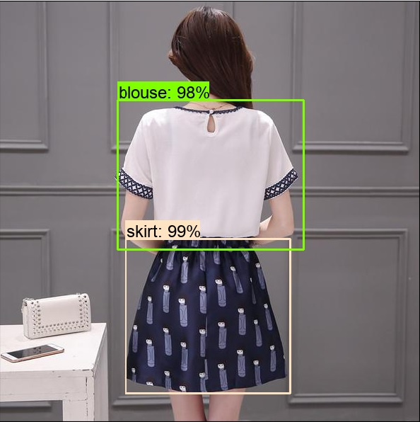
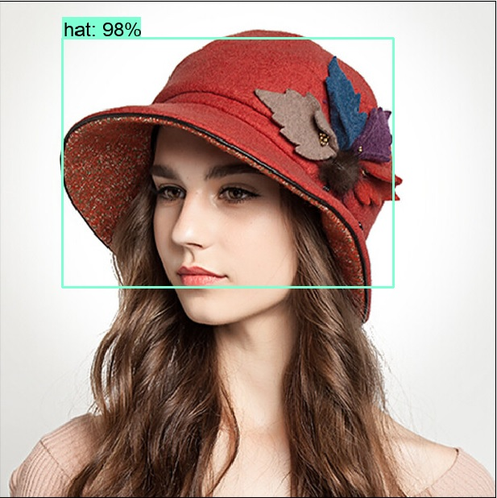
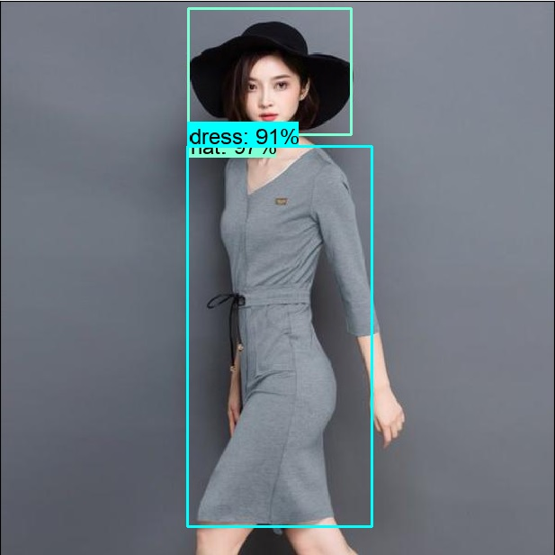

# Women Apparel Detection
This project is an implementation of TensorFlow Object Detection API for detection of women's apparel. The following six classes are handled in this project:

blouse, dress, hat, pants, shorts, skirt

The number of classes can be extended by configuring the model and training it with more data.

# Environment Setup
1. Install Python 3.6

   Create environment variables **PYTHONPATH**, and add the path of directory **Python36; Python36\Lib; Python36\DLLs; Python36\Scripts** to    **PYTHONPATH**. Add **PYTHONPATH** to **PATH** environment variable.  
   
2. Install tensorflow

```
   pip3 install --upgrade tensorflow
```

3. Install other dependencies

```
   pip install Cython
   pip install pillow
   pip install lxml
   pip install jupyter
   pip install matplotlib
 ```
 
4. Download Google Protobuf Windows v3.4.0 release “protoc-3.4.0-win32.zip” from https://github.com/google/protobuf/releases

   Extract the Protobuf download to Program Files, i.e., C:\Program Files\protoc-3.4.0-win32

5. Clone the Tensorflow model repository.

```   
   git clone https://github.com/tensorflow/models.git
```
   
   Add the path of **models\research; models\research\slim; models\research\object_detection; models\research\object_detection\utils** to **PYTHONPATH** environment variable
 
 ```
   cd path_to_tensorflow\models\research
 ```
 
   Execute the following command to compile Protobuf libraries:

```   
   “C:\Program Files\protoc-3.4.0-win32\bin\protoc.exe” object_detection/protos/*.proto --python_out=.
```

6. Clone this WomenApparelDetection repository.

```
   git clone https://github.com/jimingh/WomenApparelDetection.git
```

# To Run the Code
Navigate to WomenApparelDetection directory, copy and paste the images that will be segmented into InputImages folder. Execute imageSeg.py, which will generate segmentation results.

  

# Brief Description of Method
Faster R-CNN, R-FCN and SSD currently are the three best and most widely used object detection models. TensorFlow Object Detection API is utilzed in this project to implement the object detection models. Actually I planed to use Faster R-CNN models at the begining as Faster R-CNN can achieve the best accuracy in general. Unfortunately, I found there is a bug of the Object Detection API for Python 3 compatibility which does allow training of Faster R-CNN models in Windows OS. Considering the fact that I do not have a Linux system in hand, I choose SSD model instead, which has faster speed and comparable accuracy.

Six classes have been handled in this project, i.e., blouse, dress, hat, pants, shorts, skirt. For each class, 200 images are selected, re-sized and labeled manually to train the model. Some of the training images are from interenet, but the majority are from the product images provided. This is because the women's apparel in the product images is mostly in Aisian style, while the images from interenet could be diverse. The model has been trained using Google Cloud for around 18 hours, and the loss is smaller than 2. 
